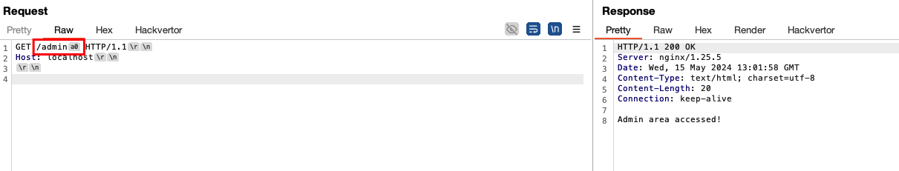

# Path Normalization 403 Bypass Labs

This repository contains different scenarios for bypassing 403s leverage path normalization inconsistencies which stem from deny rules e.g. configured in Nginx. This work is inspired by https://rafa.hashnode.dev/exploiting-http-parsers-inconsistencies.

# Setup (1 Command!)

* You can run each of the scenarios by navigating into the folder and simply executing `docker-compose up`

# Scenarios

* Goal: Is always to access `/admin`
* Problem: Nginx has a rule to deny access to `/admin` and blocks you

### Flask

* Flask removes the characters `\x85`, `\xA0`, `\x1F`, `\x1E`, `\x1D`, `\x1C`, `\x0C`, `\x0B`, and `\x09` from the URL path, but Nginx doesn't (note that it massively depends on the version of Nginx - newer version remove different characters)
* On `nginx@1.25.5`, the following two are still working: 
    - `\x85`
    - `\xa0`
* Bypass: Visit `GET /admin\x85` or `GET /admin\xa0` (note that you actually need to send the hex character, not e.g. the string `\x85`)

### Node.js (Express) - Not Working :(

* According to the referenced research, depending on the Nginx version, the following three characters may be removed from the URL by Node.js but not by Nginx: `\xA0`, `\x09` and `\x0C`
* However, we couldn't get a bypass to work (we tried `nginx@1.20.2` and `nginx@1.25.5`)

### Java (Spring Boot) 

* Working bypass on `nginx@1.25.5`: We can access the `/admin` page by visiting `GET /admin;` (no fancy hex here, literally just a `;`)

* Working bypasses on `nginx@1.20.2`
    - `GET /admin;` also works here
    - Moreover, `GET /admin\x09` (fancy hex character again!) works

### Golang (Gin) - No Known Ways :|

* I couldn't find any research about this online
* Also, I wasn't able to find any ways to bypass this myself