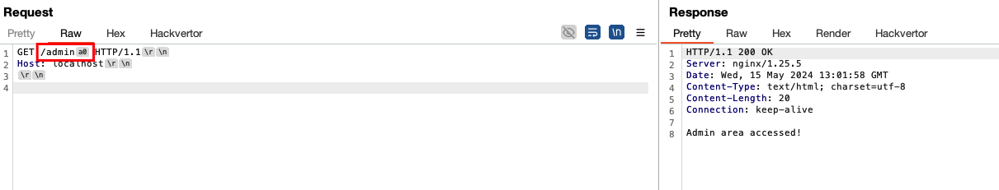

# Path Normalization 403 Bypass Labs

This repository contains different scenarios for bypassing 403s leverage path normalization inconsistencies which stem from deny rules e.g. configured in Nginx. This work is inspired by https://rafa.hashnode.dev/exploiting-http-parsers-inconsistencies.

# Setup (1 Command!)

* You can run each of the scenarios by navigating into the folder and simply executing `docker-compose up`

# Scenarios

### Flask

* Goal: Access `/admin`
* Problem: Nginx has a rule to deny access to `/admin` and blocks you
* Bypass: E.g. visit `GET /admin\xa0` (note that you actually need to send the hex character, not the string `\xa0`)

